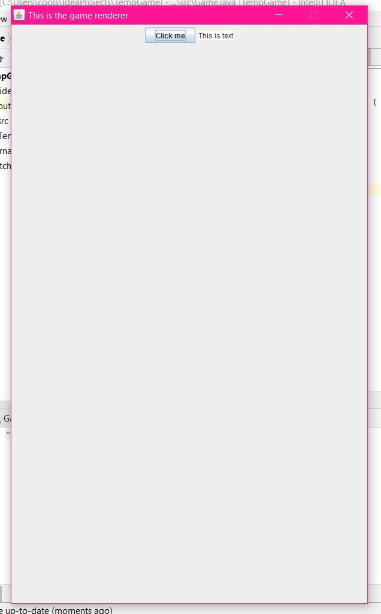
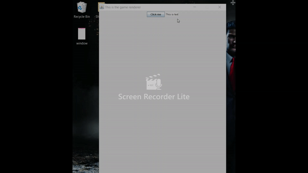

## Entry 3 

What I learned this week was mostly based off what I needed to know to make my Java game. Since my game needs a window for the user to play on, I figured that it would be best if I learned how to make a window show up on my computer before jumping into the backend of the game.

## JFrame

JFrame is a class in in Java's graphical user interface toolkit called Swing. What this class does is, as the name implies, is that it creates a frame or as we call it - a window. 

## JPanel

If you want things show up inside your JFrame window, the program requires you to use a JPanel. JPanel is also a Swing class, but it is in control of what goes inside the window (canvas). 

For example, if you wanted a button to show up in your window first you would have a to create an instance of the button class. Then add it to the instance of the JPanel class. And then add the instance of the JPanel class to the instance of the JFrame class. 

So much goes into making just a button appear in your window. There are easier ways of doing this, mainly by using graphics APIs or other development toolkits but it is better to start with the basics first before jumping into advanced programming. 

## My JFrame

My code: 
```java
public Renderer(){

        JFrame window = new JFrame("This is the game renderer");
        window.setDefaultCloseOperation(JFrame.EXIT_ON_CLOSE);
        window.setResizable(false);
        window.setSize(new Dimension(600,1000));

    }
```

The code above creates a window and specifies a few things about it.
```java
 JFrame window = new JFrame("This is the game renderer");
```
This line of code creates an instance of the JFrame and the text inside the parenthesis is the title of the window. 
```java
window.setDefaultCloseOperation(JFrame.EXIT_ON_CLOSE);
```
This line makes sure that when you prees the X at the corner of your window to exit out the program terminates. Otherwise, the program will keep running even after the window closes which is not something we want (usually).
```java
window.setResizable(false);
window.setSize(new Dimension(600,1000));
```
These two line set the size of the window and make it unresizeable by the user. 

The window is still blank so I used the code below to add some elements.

```java
        JTextArea text = new JTextArea("This is text");

        JPanel panel = new JPanel();
        JButton button  = new JButton("Click me");
        panel.add(button);
        panel.add(text);
        window.add(panel);
        button.addActionListener(new Action());
        window.setVisible(true);
```
The first three lines initialize a text area, JPanel and a button. 
```java
.add()
```
The function above adds the object in the parenthesis to the object that comes before the . (dot) operator.

After the objects are added they will show up inside the window. Well at least that's what I thought would happen. I almost gave up on life because I could not get the things I added to show up. I was about to leave the country to go live on some remote deserted island before a quick google search stopped me. it turns out that the order of the lines of code matter. Since this class runs each line of code only once, it is a good practice to leave making the window visible as the last thing you do. The line of code below makes the window visible, before I had it as my second line of code. When I moved all the way to the bottom everything was visible. 
```java
window.setVisible(true);
```
There is a `repaint()` function that updates the screen but that it more for animations, which I will be learning more about and using later. 

When you run the code the result is a window with a button and a text area as shown below.

 

Is a button really a button if it has no function?

I did not want to waste my time on philosophy, so I went ahead a added a function to it. The second to last line of code (also pasted below) links the button to an action.
```java
button.addActionListener(new Action());
```
The class `Action()` inside the parenthesis is a custom made class, the . operator function is built in.

The `Action()` class looks like this:
```java
 static class Action implements ActionListener{
        public void actionPerformed(ActionEvent e){
            JFrame window2 = new JFrame();
            window2.setSize(300,300);
            window2.setVisible(true);
            JLabel label = new JLabel("Hello world!");
            JPanel panel2 = new JPanel();
            panel2.add(label);
            window2.add(label);

        }
    }
```
The main to note here is that this class implements the ActionListener interface. Basically, ActionListeners "listen" for an action and execute the code provided when an action as been "heard."

What should happen when the button is pressed is that a new window should pop up saying "Hello World." 




## Takeaways

Don't be afraid to and don't forget to GOOGLE. Tinkering is all fun and games until you mess something up and nothing works. Instead of beating yourself up just google away your problems. I was so determined to get my elements to show up when they weren't that I totally had forgotten to look up the issue I was facing. Just keep in mind that google will always be there for you in your darkest hours.  

## Goals for next week

I will add a spacecraft and controls to it. 


