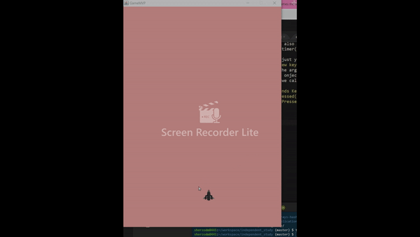

## ENTRY 5

Every game has to have some form of controls so the player can actually play the game. The main thing I did week was just that, I started to add controls to the only sprite I have so far. 

More specifically, I programmed the controls so that when the left arrow is pressed the sprite moves left and when the right arrow is pressed the sprite moves right. 

## KEY LISTENER

To create a key listener, you need to define a method with the name `keyPressed(KeyEvent e)`. Then inside this method you specify how the desired key strokes are handled.

In this case, first I need to know which key is being pressed, left or right. Every time you press a key, that key returns a specific keycode that tells the computer which key have been pressed. In Java, the method that captures this keycode is `e.getKeyCode()`. All I needed to complete the logic was an if statement comparing the keycode to the keycode of the left and right keys, left being `KeyEvent.VK_LEFT` and right being `KeyEvent.VK_RIGHT`. If any of the keys match, the value of the variable that decides the speed of the animation changes. 

```java
public void keyPressed(KeyEvent e){
        int key = e.getKeyCode();

        if (key == KeyEvent.VK_LEFT){
            dx = -2;
        }
        if (key == KeyEvent.VK_RIGHT){
            dx = 2;
        }

    }
```

**NOTE:** The animation speed can also be adjusted to some degree by changing the value of the timer() method.

The above code does not work just yet. For it to work we need to call the `addKeyListener(new keyAdapter());` method to listen for keyboard inputs. The argument that goes into the listener must extend or be an onject of the `KeyAdapter` class. In the argument class we call the keyPressed method:
```java
private class keyAdapter extends KeyAdapter  {
            public void keyPressed(KeyEvent e){
                spaceship.keyPressed(e);
            }
        }
```
Demo:


My goals regarding the animation of this sprite is that I want to fix it so that it does not leave streak on the left side (or any for that matter) and I want to restrict the domain preferably between zero and the width of the window. 

## TAKEAWAYS

Don't be afraid to copy as long as you make sure to understand what it is that you're copying and to add onto it or remix it. I thought that I would jeopardize learning if I straight up copied, so I tried looking over the code and remixing it in my head and then writing it down. However, that turned out to be a bad idea since I was a constantly getting various types of errors and that was truly jeopardizing my learning. So I found it best to copy the necessary code, understand it, and change it so that it works for my situation. (This strategy can apply to other things not just to coding.)   