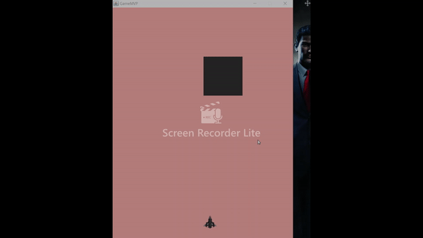

## ENTRY 6

This was not as linear as the previous ones in terms of progress and learning. I ended up spending the entire week on something that I thought was not going to take more than a few class periods. 

What this simple thing was was making a rectangle show up on the screen. To be more exact I was trying to make a class that would create an instance of rectangle with parameters for x, y, width, and height.

First I tried to make a rectangle show up without making a class. It seemed like even after 50 attempts I could not get one to show up. Since my code and the tutorial's code on the rectangle was different I was continuously failing at drawing a rectangle. 

After a couple hundred more tries (I'm exaggerating) I got it to work. It turns out that there are multiple ways of making a rectangle. I was mixing the steps of one method with the steps of the other and expecting an outcome. (Analogy: similar to fixing a broken car with parts from a different car brand. It won't work because the parts are not compatible.)

When it came to making a rectangle class, there were more problems. I pasted in the code for a rectangle and created an instance and ran the program and there was no sign of a rectangle. What made it difficult to debug was that I was not getting any errors, so I have a no way of knowing which of the three classes was giving me the trouble. 

I couldn't really google my problem since it was specific to my case. The only approach to fixing it was trial and error. It turns out the problem was in two classes. 

```java
public void drawObs(Graphics g){
        Graphics2D g2d = (Graphics2D) g;
        g2d.fillRect(x,y,w,h);

    }
```
In my rectangle class I (after many failures) made a new method with `Graphics2D g2d = (Graphics2D) g;` and in my board class I called the `drawObs()` method on the instance of rectangle class inside the `paintComponent` method. Then wala...it worked.

Since these rectangles needed to work, I, then, added some to animate them. 

```java
public void move(){
        y += velY;
    }
```

This code in addition to calling it the board method then telling the `action` method to `repaint()` it makes to move from the top of the screen to the bottom. 
Demo:


## TAKEAWAYS
I went through all of this hassle was because I needed a rectangle class, not just a rectangle. The reason for wanting a class is that this game will need at least a couple hundred rectangles. With a class I can make an unlimited number of them with just a few lines of code. This is much more faster and efficient then writing a line of code for each rectangle I want to create. What I am trying to say is that **it is better to experience short term loss in exchange for long term gain then to experience short to gain in exchange for long term loss.**    
