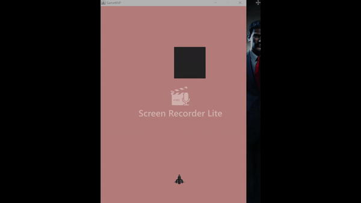

## ENTRY 7 

This week I tried to put my rectangle class to use by creating many instances of it. That was by far the easiest part.

The thing that turned out to be very tricky was making so that the rectangle would move in an army march fashion, one rectangle following the one in front.

My initial thought was that all that I needed to do was add some sort of delay function in the method that draws the rectangles. After adding the delay function, the window would pop up but not the objects. It turns out the delay function had to run its course before letting the objects load. The load time became a minute and a half and the rectangles still spawned on top of each other. 

Since the initial idea was a failure I had to rethink my approach to the problem.

Then I thought about implementing multithreading into my program to handle the rectangle animation. The usual way computing is single threaded in which the computer runs the code in order that its written in. This is okay if your program does one thing. But if you want it to do more than one thing at a time multithreading is very useful. My thinking was that by letting another thread control the rectangles I would be able to achieve what I wanted. After days of tinkering, I came to the conclusion that multithreading was an overkill for a small program and I would still face the same problems. 

After googling and youtubeing, it kind of hit me. When instantiating a rectangle, all that I would need to do is lower the y position. So when all of them are drawn out they would be one line with a little space in between them. One limitation to this approach is that you need to specify how many rectangles there will be in the game. The game might need an unlimited number of rectangles depending on how good the player is. Although this a temporary solution, it will do for an MVP. 

```java 
    for(int i = 0;i < arrSize;i++){
            arrayList.add(new Obstacle(350,offset,150,75));
            offset-= 300;
        }
```
Those lines of code above, give this: 


## TAKEAWAYS
Before starting something do your research. If I had known that I would be spending this amount of time to make simple animations, I would have a chosen a much more powerful graphics API and that would have helped me make progress at a higher rate. 
