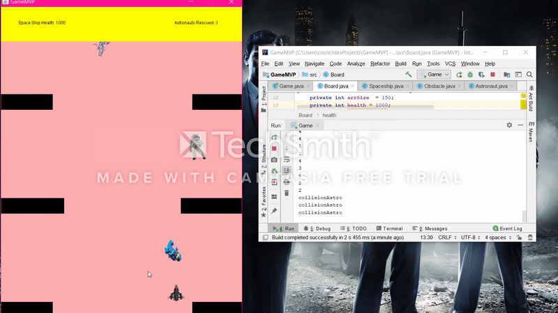
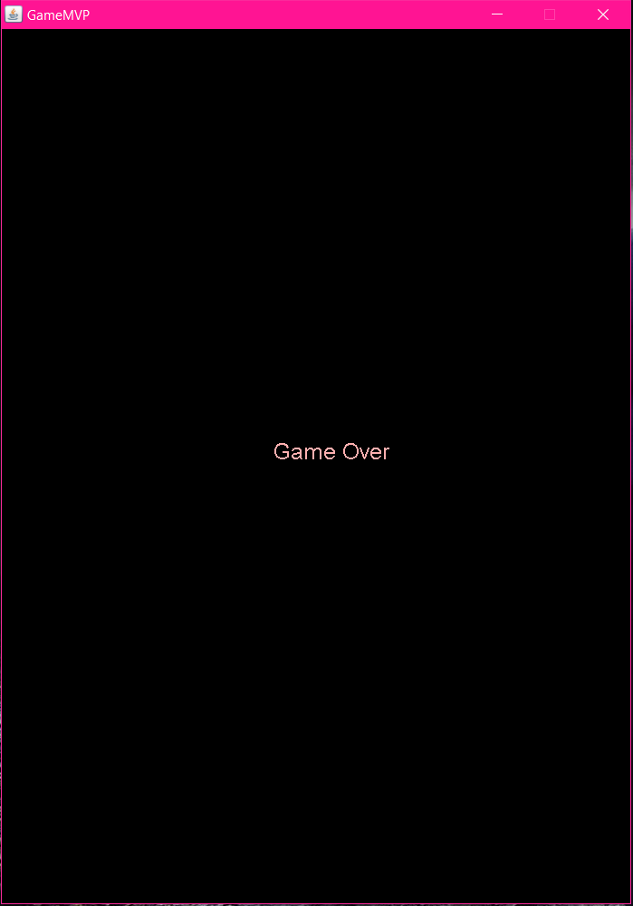

## ENTRY 9

This week I was very productive, I'm pretty sure it was because of the deadline. (But I digress). I was able to finish my MVP and so far it's working the way I want it to. 

I am not going to include code in this blog because there is just a lot that I added. So instead I will upload the code for the game to GitHub once I figure out how to do that from my local Java IDE (repo name: JAVASpaceShipGameMVP). 

I will just list the changes I have made this week:
* Now there are obstacles on both sides
* The width for each row of obstacles is generated randomly from a given range
* Both sides have collision detection
* Now there are astronauts that you need to rescue
* They also have collision detection, that's how they get rescued
* Starting health is a 1000
* The game tells you how many astronauts you have rescued
* When health is below a zero a Game Over screen pops up 

Concept of the game:
You press the directional keys to control where the ship goes, the catch is that the ship will keep going in that direction. So you'll need to stabilize it as to not hit the obstacles. Hitting them will cause your health to go down. Also you need to rescue the astronauts. 

This is a short gif gameplay of the game:

This is a screenshot of the Game Over popup:

## TAKEAWAYS
**Try to get in the zone.** The longer the duration of your work in one sitting the more productive you'll be. I have noticed that with myself. I have noticed that I will get more work done if I just sit down and work for longer periods of time compared to working little by little each day.   

